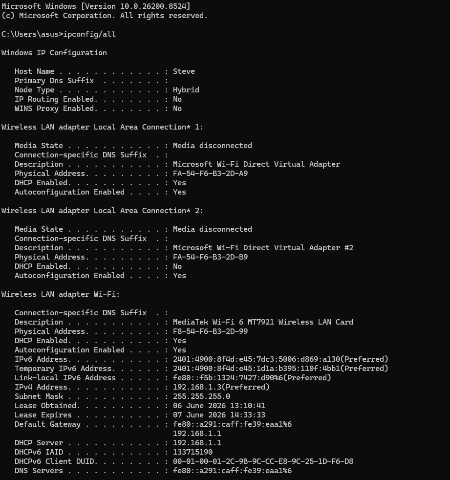
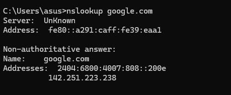
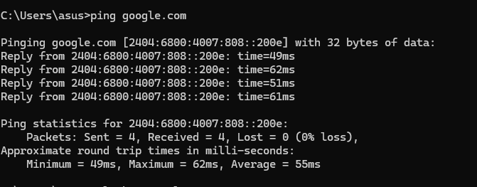

** Networking Task 02: Network Devices & IP Addressing **

Student Information

Name:Stephen J
Date:June 2026

---

Objective

The purpose of this task is to understand common network devices, IP addressing concepts, and how data travels within a network.

---

Part A: Network Devices Research

Router

Purpose

Connects different networks and provides Internet access.

How it Works

Routes data packets between local devices and external networks using IP addresses.

Real-World Usage

Home Wi-Fi routers, office networks, ISP routers.

---

Switch

Purpose

Connects multiple devices within the same network.

How it Works

Uses MAC addresses to forward data to the correct device.

Real-World Usage

Office LANs and computer labs.

---

Hub

Purpose

Connects multiple devices in a network.

How it Works

Broadcasts data to all connected devices regardless of destination.

Real-World Usage

Older networks and learning environments.

---

Access Point

Purpose

Provides wireless connectivity.

How it Works

Extends a wired network into a wireless network.

Real-World Usage

Wi-Fi hotspots, offices, universities.

---

Firewall

Purpose

Protects a network from unauthorized access.

How it Works

Monitors and filters incoming and outgoing traffic.

Real-World Usage

Home routers, enterprise security systems.

---

Modem

Purpose

Connects a home or office network to the ISP.

How it Works

Converts digital signals to analog and vice versa.

Real-World Usage

Broadband Internet connections.

---

Part B: IP Address Classification

| IP Address    | Category | Reason                                             |
| ------------- | -------- | -------------------------------------------------- |
| 192.168.1.10  | Private  | Reserved private range 192.168.x.x                 |
| 10.0.0.5      | Private  | Reserved private range 10.x.x.x                    |
| 172.16.5.20   | Private  | Reserved private range 172.16.0.0 - 172.31.255.255 |
| 8.8.8.8       | Public   | Google's public DNS server                         |
| 1.1.1.1       | Public   | Cloudflare public DNS server                       |
| 192.168.100.1 | Private  | Reserved private range 192.168.x.x                 |

---

Part C: Understanding My Network

| Parameter       | Value       |
| --------------- | ----------- |
| IPv4 Address    | 192.168.1.3 |
| Default Gateway | 192.168.1.1 |
| DNS Server      | 192.168.1.1 |

Which IP range does your device belong to?

192.168.1.x range.

Is it Public or Private?

Private IP Address.

What role does your router play?

The router connects my local network to the Internet and directs network traffic between devices and external servers.

What would happen if the DNS server stopped working?

Websites could not be accessed using domain names. Users would need to enter IP addresses manually.

---

Part D: Network Communication Flow

```text
Your Device
      ↓
Router
      ↓
DNS Server
      ↓
Google Server
      ↓
Response Back
      ↓
Your Device
```

Communication Process

1. The user enters [www.google.com](http://www.google.com) in the browser.
2. The router forwards the DNS request.
3. The DNS server returns Google's IP address.
4. The device sends a request to Google's server.
5. Google processes the request and sends a response.
6. The webpage is displayed in the browser.

---

Part E: Practical Command Exercise

Commands Used

```cmd
ipconfig /all
nslookup google.com
ping google.com
```
Screenshots

## IP Configuration




## DNS Lookup



## Ping Test




Questions

What IP address did DNS return for Google?

The DNS server resolved the domain name google.com to the IPv6 address 2404:6800:4007:833::200e. This address was returned by the DNS server and used by my device to communicate with Google's server.
Was the ping successful?

Yes, the ping was successful.

Why is DNS important before communication begins?

DNS converts domain names into IP addresses so devices can locate and communicate with servers.

---

Learning Outcomes

* Network Devices
* Public vs Private IPs
* DNS Resolution
* Router Functions
* Network Communication Flow
* Basic Networking Commands

---

Conclusion

This task improved my understanding of network devices, IP addressing, DNS resolution, and how data travels between a device and Internet servers.
